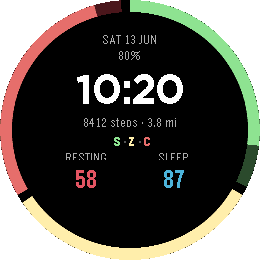
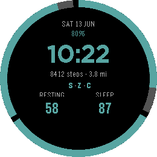
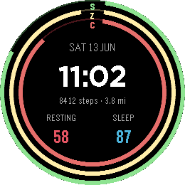
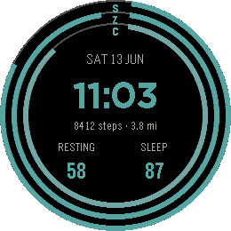
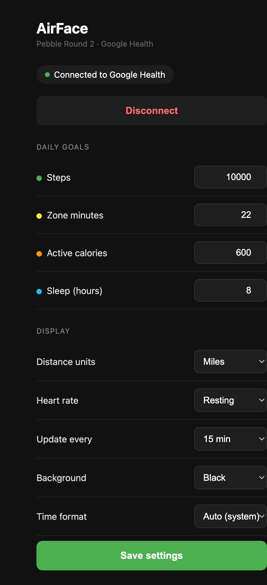

# airface

A Pebble Round 2 watchface that shows your Fitbit Air health stats — pulled
live from the Google Health API — as three activity rings plus a clean,
glanceable readout.

**Hardware:** Pebble Round 2 ("gabbro", 260×260 color e-paper) + Fitbit Air
**Phone:** iPhone running the Google Health app (data syncs through Google's
cloud, so iOS vs Android doesn't matter)

<p align="center">
  <b>Arc ring · Color</b>&nbsp;&nbsp;&nbsp;&nbsp;&nbsp;&nbsp;&nbsp;&nbsp;&nbsp;&nbsp;&nbsp;&nbsp;&nbsp;&nbsp;&nbsp;&nbsp;&nbsp;&nbsp;<b>Arc ring · Monochrome</b>
</p>
<p align="center">
  
  &nbsp;&nbsp;
  
</p>
<p align="center">
  <b>Classic · Color</b>&nbsp;&nbsp;&nbsp;&nbsp;&nbsp;&nbsp;&nbsp;&nbsp;&nbsp;&nbsp;&nbsp;&nbsp;&nbsp;&nbsp;&nbsp;&nbsp;&nbsp;&nbsp;&nbsp;&nbsp;<b>Classic · Monochrome</b>
</p>
<p align="center">
  
  &nbsp;&nbsp;
  
</p>

## The face

Two ring layouts are available — switch between them in settings.

**Arc ring** (default) — a single outer ring divided into three arc segments,
each filling clockwise toward a daily goal. The open interior gives the time
room to breathe, with date, battery, steps, and the resting-HR / sleep readouts
stacked below.

**Classic** — three concentric rings fill inward from the edge, with labels in
a small gap at 12 o'clock.

| Metric | Ring / segment | Default goal |
|--------|---------------|--------------|
| Steps | S — green | 10,000 |
| Active zone minutes | Z — yellow | 22 |
| Active calories | C — orange | 600 |

Both layouts support two color themes:
- **Color** — green (steps), yellow (zone minutes), orange (calories)
- **Monochrome** — teal throughout; quieter on the wrist

Six metrics in total come from Google Health: **steps, distance, active zone
minutes, active calories, resting heart rate, and sleep**.

## What you can configure

Everything below is set from the companion settings page (no rebuild needed) —
it opens from the Pebble app, prefilled with your current values, and pushes
changes to the watch on save.

<p align="center">
  
</p>

| Setting | Options | Default |
|---------|---------|---------|
| Steps goal | any | 10,000 |
| Zone-minutes goal | any | 22 |
| Active-calories goal | any | 600 |
| Sleep goal | hours | 8 |
| Distance units | miles / km | miles |
| Heart rate | resting / daily average / daily min–max | resting |
| Update frequency | 10 / 15 / 30 / 60 min | 15 min |
| Background | black / navy | black |
| Color theme | color / monochrome (teal) | color |
| Ring layout | SHD segment / classic concentric | SHD segment |
| Time format | auto (system) / 12-hour / 24-hour | auto |

## Architecture

```
Fitbit Air ──BLE──> Google Health app (iPhone) ──sync──> Google Health cloud
                                                              │
                                                              ▼ HTTPS (OAuth 2.0 PKCE)
Pebble Round 2 <──AppMessage/BT── PebbleKit JS (in Pebble iOS app)
```

- `src/c/airface.c` — watchface UI: rings, time/date, readouts. Caches
  last-known values + settings in persist storage so the face still works when
  the phone is unreachable.
- `src/pkjs/index.js` — phone-side companion: fetches from
  `health.googleapis.com/v4/`, sends compact integers to the watch, and mirrors
  the current settings alongside every stats push.
- `docs/config.html` — the settings page (also deployed to
  [AirFaceApp/AirFaceApp.github.io](https://github.com/AirFaceApp/AirFaceApp.github.io);
  live at `airfaceapp.github.io`).
- `workers/token-exchange.js` — a Cloudflare Worker that holds the OAuth client
  secret and exchanges authorization codes / refresh tokens, so the secret
  never ships in client-side code.

### OAuth

Sign-in uses the OAuth 2.0 **PKCE** flow (public client, no secret in the app).
The config page kicks off Google sign-in; the callback exchanges the code for a
refresh token via the Cloudflare Worker; the token is stored in PKJS
`localStorage` and used to mint short-lived access tokens.

The Google Health API replaces the Fitbit Web API (which is retired in
Sept 2026) and covers all Fitbit devices, including the Fitbit Air.

## Using AirFace

The companion settings page and OAuth flow are hosted at
**[airfaceapp.github.io](https://airfaceapp.github.io)**. Users connect once via
Google sign-in; no account or setup beyond that is needed. OAuth runs through
the author's Google Cloud project — the `CLIENT_ID` is a public identifier (not
a secret) and is visible in the source as designed.

> **Unverified app notice:** until the app completes Google's OAuth verification
> process, Google will show a warning screen during sign-in. Click "Advanced →
> Proceed" to continue. This is expected for small indie apps.

## Setup (run your own instance)

If you want to host your own backend rather than using the shared one:

1. **Google Cloud** — create a project, enable the **Google Health API**, and
   create an OAuth 2.0 client (Web application type). On the consent screen
   (External), add yourself as a **test user**; request the activity,
   heart-rate, and sleep read-only scopes. Set the authorized redirect URI to
   your callback page URL.
2. **GitHub Pages** — fork or copy `config.html` and `oauth/callback.html` to a
   public repo and enable Pages. Point `REDIRECT_URI` / `CONFIG_URL` at it.
3. **Cloudflare Worker** — deploy `workers/token-exchange.js`
   (`wrangler deploy --name <your-worker> --compatibility-date <today>`), then
   set your client secret: `wrangler secret put CLIENT_SECRET`. The secret
   lives only in the Worker, never in client code.
4. Swap the `CLIENT_ID` constant in `config.html` and
   `workers/token-exchange.js`, update the Worker URL in
   `src/pkjs/index.js` and `oauth/callback.html`, and update `ALLOWED_ORIGINS`
   and `REDIRECT_URI` in the Worker.

## Developing

```bash
pebble build
pebble install --emulator gabbro
pebble screenshot --emulator gabbro --no-open shot.png
pebble logs --emulator gabbro        # watch + PKJS console output
```

Without a refresh token the companion serves **mock data** — enough to develop
the whole UI. To test against real Google Health data in the emulator, paste a
refresh token into `DEV_REFRESH_TOKEN` in `src/pkjs/index.js` (clear it before
committing — it's the one thing that must never land in git). To obtain one,
open the config page in a desktop browser, run
`localStorage.setItem('airface_dev','1')` in the console, then connect — the
callback prints the token (this dev path is off by default for everyone else).

> Adding a new `messageKeys` entry in `package.json` requires `pebble clean`
> before the next build so the generated `MESSAGE_KEY_*` header is regenerated.

## Roadmap

- [x] M1 — scaffold: renders time/date/stats end-to-end with mock data
- [x] M2 — Google OAuth (PKCE + Cloudflare Worker) and real Health API calls
- [x] M3 — design pass: three activity rings, resting-HR readout, refined
      time-hero layout, full settings page (goals, units, HR mode, update
      cadence, background, time format)
- [x] M3.5 — infrastructure: AirFaceApp GitHub org, pages migrated to
      `airfaceapp.github.io`, app-branded OAuth consent screen, public release
- [x] M3.6 — visual alignment with [HealthFace](https://github.com/HealthFaceApp/HealthFace):
      S/Z/C ring labels in a 12-o'clock gap, monochrome teal theme
- [x] M3.7 — SHD segment ring layout: single outer arc divided into S/Z/C
      segments; battery % above time; toggled via Ring layout setting
- [ ] M4 — on real hardware (July 2026): battery tuning, sunlight/e-paper
      check, judge both color themes on the actual display,
      final polish before Rebble store submission
- [ ] M5 — Rebble app store submission
- [ ] Later — Google OAuth verification (needed to exceed 100 users / remove
      unverified warning); stale-data indicator; custom font for larger time;
      port to Alloy once it leaves developer preview

## Notes

- The watch has no WiFi — all HTTP happens phone-side; the face shows
  last-known values when the phone is unreachable.
- The Fitbit Air syncs to the cloud periodically, so polling more often than
  ~15 min buys little; resting HR can lag a day or two (it's computed with
  sleep).
- Pebble's display has a 64-color palette with coarse steps, so subtle
  near-black tints aren't possible — hence the black/navy background choice.
